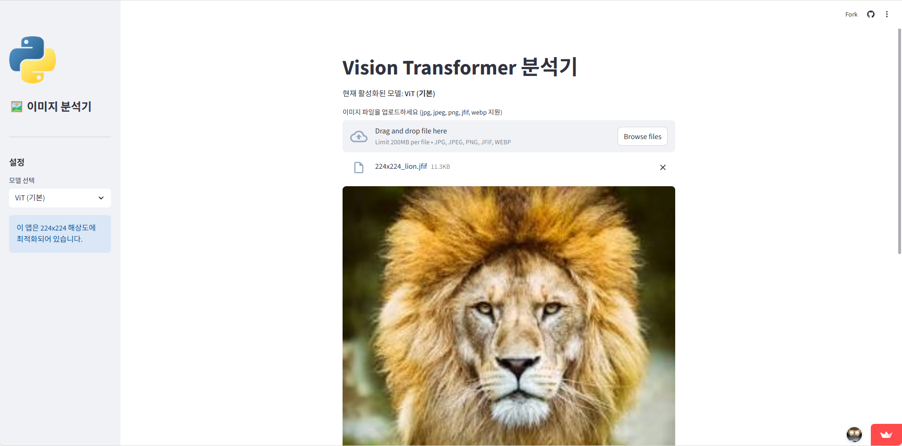

# mission_17
mission_17

[Streamlit Cloud URL](https://mission15-lrpurpfnraysfwswf8aoia.streamlit.app/) : https://mission15-lrpurpfnraysfwswf8aoia.streamlit.app/

# 🤖 Hybrid Vision AI: Multi-Task Image Analyzer

사용자가 업로드한 이미지를 **일반 사물 분류(Classification)**부터 최신 멀티모달 LLM을 활용한 **대화형 시각 분석(VQA)**까지 수행하는 통합 AI 비전 웹 서비스입니다.

> **👉 서비스 바로가기:** [https://your-app-link.streamlit.app/](https://your-app-link.streamlit.app/)

---

## 📅 프로젝트 개요

- **미션**: 단순한 이미지 분류를 넘어, 객체 탐지 및 생성형 AI(Qwen2.5-VL)를 결합하여 이미지의 맥락을 깊이 있게 이해하는 고도화된 AI 서비스를 구현합니다.
- **주요 기능**:
  - 🔍 **하이브리드 모드**: 고속 분류(ViT/ResNet)와 심층 대화형 분석(Qwen) 중 선택 가능
  - 🎯 **객체 탐지(Object Detection)**: 이미지 내 사물의 위치를 파악하고 바운딩 박스 시각화
  - 💬 **Visual Question Answering**: 이미지 속 상황에 대해 AI와 자연어로 질의응답
  - ⚡ **최적화된 추론**: 모델별 전용 프로세서 및 캐싱 기술을 통한 응답 속도 향상
  - 📱 **반응형 디자인**: `width='stretch'` 옵션을 적용하여 PC와 모바일 모두 최적화된 레이아웃 제공

---

## 🖥️ 실행 화면

|          이미지 분류 및 탐지           |            대화형 AI 분석             |
| :-------------------------------: | :-------------------------------: |
|  |  |
| _ViT/DETR 모델을 이용한 분석_ | _Qwen2.5-VL 모델과의 시각적 대화_ |

QWEN 구현은 로컬PC에서는 확인되었으나, Streamlit Cloud에서는 로딩 실패로 확인이 불가함.
---

## 🛠️ 기술 스택 및 사용 모델

이 서비스는 **Streamlit** 프레임워크를 기반으로 하며, Hugging Face의 최신 모델들을 활용합니다.

### 1. 표준 비전 모델 (Standard Vision)
- **Classification**: `google/vit-base-patch16-224`, `microsoft/resnet-50`
- **Object Detection**: `facebook/detr-resnet-50`
- **Library**: `transformers`, `timm` (Backbone 지원), `Pillow`

### 2. 멀티모달 대화형 AI (Generative Vision)
- **Model**: `Qwen/Qwen2.5-VL-3B-Instruct`
- **특징**: 이미지 내 텍스트 인식(OCR), 사물 간의 관계 추론 및 상세 묘사에 특화
- **Library**: `qwen-vl-utils`, `accelerate`

---

## 📝 개발 과정 및 트러블슈팅 (Troubleshooting)

### Issue 1. Qwen 모델의 Pipeline 호환성 에러
- **문제**: `pipeline("image-classification")` 사용 시 `NoneType` 관련 Embedding 에러 발생.
- **해결**: Qwen 모델은 멀티모달 전용 `Processor`를 통해 이미지와 텍스트를 동시에 토큰화해야 함을 확인하고, 모델 타입에 따른 전용 추론 로직(Inference Logic)을 구축하여 해결했습니다.

### Issue 2. 의존성 라이브러리 충돌 및 누락
- **문제**: 객체 탐지 모델 구동 시 `timm` 라이브러리 부재로 인한 `ImportError` 발생.
- **해결**: `requirements.txt`에 `timm`과 `Pillow`를 명시하고, 설치 이름과 임포트 이름의 차이를 관리하여 배포 환경을 안정화했습니다.

### Issue 3. UI 가이드라인 준수 및 가독성 개선
- **문제**: `use_container_width` 매개변수 업데이트로 인한 경고 메시지 발생.
- **해결**: 최신 Streamlit 문법에 맞춰 이미지 출력 옵션을 `width='stretch'`로 변경하여 가부하를 줄이고 시각적 완성도를 높였습니다.

---

## 📂 리포지토리 구조

- `app.py`: 통합 서비스 메인 로직 및 UI 구성
- `app_header.py`: 모델 딕셔너리 관리 및 사이드바 모듈화
- `requirements.txt`: 서비스 운영을 위한 라이브러리 의존성 목록

---

Copyright © 2026 Chung. All rights reserved.
